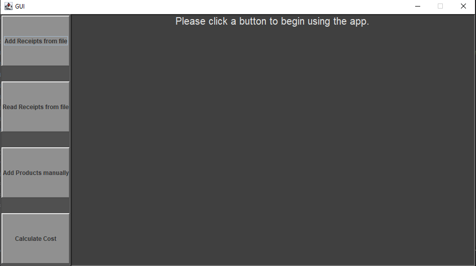
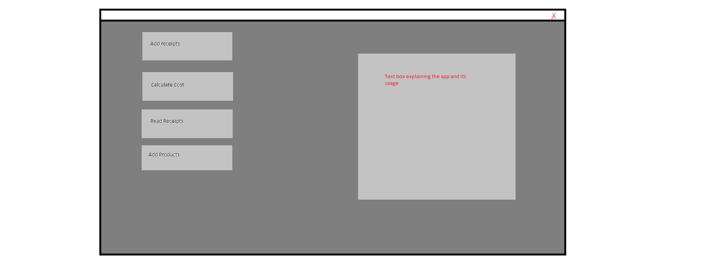
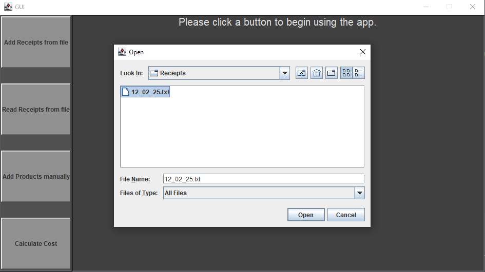
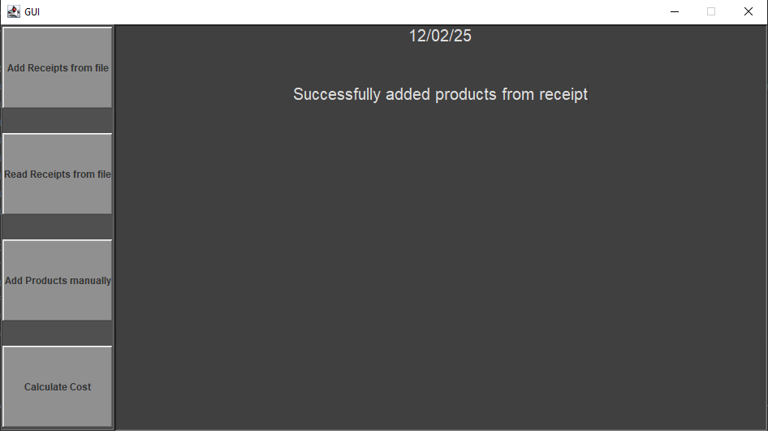
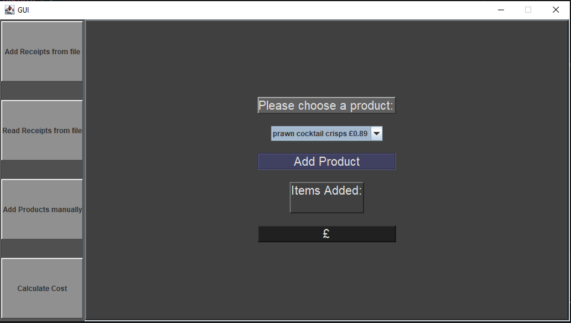
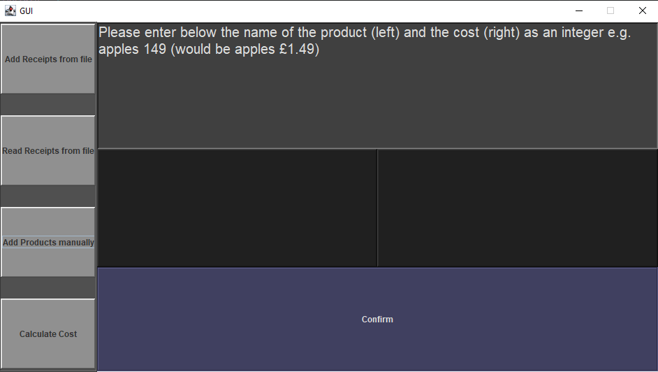

# Shopping-Calculator

A fairly simple app I made to allow me to import receipts as .txt files and extract products + prices from them. These values are then used for a calculator to add up future shopping trips. Coded using Java + Jswing.
